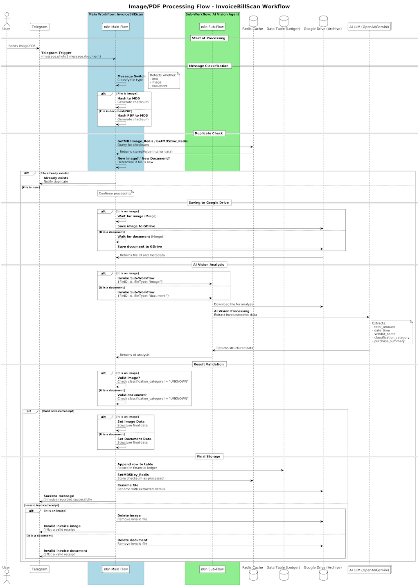

# InvoiceBillScan

## 🤖 N8n Ledger Automation for Homelab

**InvoiceBillScan** is a custom n8n workflow solution designed for **homelab enthusiasts** to streamline personal finance administration. It leverages a dedicated **AI Vision Agent Sub-Workflow** to intelligently analyse images and PDF documents of receipts and invoices, extracting key financial data into a strictly structured JSON format.

The project's goal is to convert messy, unstructured file data (such as total amount, date, vendor, and tax ID) into a clean, standardised object, ready for analysis and archiving. The data is formatted using specifications like **ISO 8601** for dates and decimal points for currency, ensuring seamless integration with other homelab tools.

---

## 🎯 Primary Use Case

The project enables the instant, automated logging of expenses simply by forwarding a photograph or document to a dedicated Telegram bot.

1.  **Rapid Input:** A user forwards a photo or a PDF of a receipt to a **Telegram** bot.
2.  **Validation & Storage:** The main workflow calculates the file hash (MD5 checksum), checks for duplicates against the Redis cache, and archives the file in **Google Drive**.
3.  **AI Data Extraction:** The main workflow then calls the **AI Vision Agent Sub-Workflow** to perform the heavy lifting of OCR and data parsing.
4.  **Registration:** The sub-workflow returns the structured data, which the main workflow then logs to the **Data table**.
5.  **Confirmation:** The Telegram bot notifies the user of the successful registration.

Screenshot 

## 🤖 Secondary Use Case: Ledger Chatbot Queries

Users can interact with the same Telegram bot to query their financial ledger or request summaries, enabling a conversational interface for expense insights.

1.  **Query Input:** The user sends a natural-language query to the Telegram bot (e.g., "Show me last month's total expenses", "What did I spend at supermarkets this week?").
2.  **Intent Parsing:** An **If** node in the main workflow routes messages that contain text but no media to the **Chatbot Handler** branch.
3.  **Data Retrieval:** The workflow reads the **Data Table** ledger, filters rows based on the parsed date range or category, and aggregates expense data.
4.  **AI Summarisation:** The aggregated data is sent to the **AI LLM** node (DeepSeek) with a prompt to generate a concise summary or list as per the user’s query.
5.  **Response Delivery:** The bot sends back a formatted text response or table to the user in Telegram.

Screenshot 

---

## ⚙️ Workflow Architecture Overview

### Sequences Diagrams

- **Invoice Ingestion & Archival:** 


- **Ledger Chatbot Interaction:** 


The solution consists of two key n8n workflows:

### 1. Main Workflow (`invoiceBillScan`)


The main flow (**invoiceBillScan**) handles file ingestion, duplicate checks, archival, AI extraction, and now also routes text-only messages to the **Chatbot Handler** for ledger queries.

### 2. AI Vision Agent Sub-Workflow (`retrieveImageFlow`)
This specialised sub-workflow is executed by the main flow and focuses entirely on AI-powered data extraction.

| Component | Function | Technology Used |
| :--- | :--- | :--- |
| **Trigger** | Activated by the main workflow, receiving the file ID and type (`image` or `document`). | `When Executed by Another Workflow` |
| **File Retrieval** | Downloads the file from Google Drive using the received file ID. | `Google Drive` |
| **Routing** | Uses a **Switch** node to route the file based on its type. | `Switch` |
| **Image Analysis** | Sends image files (e.g., JPEG, PNG) to the **OpenAI Vision model** (`gpt-4o-mini`) along with a highly specific system prompt for structured JSON extraction. | `OpenAi` (Vision) |
| **Document Analysis**| Sends PDF files to the **Google Gemini model** (`gemini-2.0-flash-lite`) along with the same system prompt for OCR and extraction. | `Google Gemini` |
| **JSON Cleaning** | **Code** nodes clean the raw text output from the LLMs (removing Markdown backticks) before parsing it into a clean JSON object, which is then returned to the main workflow. | `Code` (JavaScript) |

---

## 🚀 Pre-requisites

To successfully deploy and utilise this workflow, you will require the following components and configurations within your n8n instance:

### 1. N8n Nodes and External Services
| Service | Configuration Notes |
| :--- | :--- |
| **n8n** | A functional n8n instance (self-hosted or cloud) with public access enabled for the Telegram webhook. |
| **Telegram** | A dedicated **Telegram Bot** and the relevant **Chat ID** for submissions. |
| **Google Drive** | **Google Drive OAuth2** credentials for file saving and downloading. |
| **Data table** | **n8n internal function (beta)** for reading/writing the ledger data. |
| **DeepSeek Account** | An active API key is required for the chat model. | `DeepSeek` |
| **OpenAI Account** | An active API key is required for the image processing path. | `OpenAi` |
| **Google Gemini Account** | An active API key is required for the PDF processing path. | `Google Gemini` |
| **Redis cache** | A cache system required for storing MD5 checksums to avoid duplicated files. | `Redis` |

## 🚀 Running n8n with Docker

Since this project is designed for a **homelab**, using Docker is the recommended way to deploy n8n securely and reliably.

### Basic Docker Setup

To quickly get n8n running, you can use the official Docker image. This command launches n8n on port `5678` with persistent data storage.

```bash
docker run -it --rm \
    --name n8n \
    -p 5678:5678 \
    -v ~/.n8n:/home/node/.n8n \
    n8nio/n8n
```

---
## 💾 Quick Guide: How to Import the Workflows

Since this project consists of two linked workflows, you must import them both and ensure the main flow is linked correctly to the sub-flow.

### Steps to Import n8n workflows

1.  **Open n8n:** Navigate to your running n8n instance (e.g., `http://localhost:5678`).
2.  **Access the Workflows:** In the left sidebar, click on **Workflows**.
3.  **Import the Files:**
    * Click the **New** button, then select **Import from File**.
    * First, upload the **Main Workflow** (`invoiceBillScan.json`).
    * Repeat the process and upload the **Sub-Workflow** (`retrieveImageFlow.json`).
4.  **Activate the Sub-Workflow:** Go to the `retrieveImageFlow` (Sub-Workflow) and click the **Activate** toggle in the top right corner. **This workflow must be active** for the main flow to call it.
5.  **Update the Main Workflow Link (Crucial Step):**
    * Open the `invoiceBillScan` (Main Workflow).
    * Locate the two **Execute Workflow** nodes:
        * `Analyze image Sub-Workflow`
        * `Analyze document Sub-Workflow`
    * For **both** nodes, open the settings and verify that the **Workflow** selection points to the newly imported `retrieveImageFlow`.
6.  **Configure Credentials:** Update all nodes that require credentials (Telegram, Google Drive, Redis, DeepSeek, OpenAI, Google Gemini) using your specific homelab credentials.
For detailed configuration instructions, please see the **Setup Guide** file: [Configuration Steps](setup.md)
7.  **Activate the Main Workflow:** Once configurations are complete, click the **Activate** toggle for the `invoiceBillScan` workflow. Your Telegram webhook should now be active.

### 2. Required Data Schema

* **Google Drive:** A specific target folder is needed for file storage.
* **Data table (from n8n):** The target table must contain the following exact column headers to successfully map the workflow output. **Strict adherence to column names is required.**

## 📝 Data table Ledger Schema Description

Here is the description for each column in your data table, detailing its purpose, source, and expected format. This schema is essential for the n8n workflows to correctly read and write data.

| Column Name | Description | Source | Format |
| :--- | :--- | :--- | :--- |
| **ID_gDrive** | A unique numerical identifier assigned by Google Drive to each file. | Google Drive | String |
| **checksum** | An **MD5 hash** of the uploaded file (image or document). This value is used by the workflow to prevent duplicate entries of the same receipt. | n8n Flow | String (32-character MD5) |
| **filename** | The original name of the file uploaded via Telegram (e.g., `IMG_1234.jpg`). | n8n Flow | String |
| **user** | The Telegram username or unique ID of the person who submitted the receipt. Useful for tracking expenses in multi-user setups. | Telegram | String |
| **date** | The precise timestamp (date and time) when the receipt or invoice was initially uploaded and processed by the n8n flow (System Upload/Processing Timestamp). | n8n Flow | String (ISO 8601, e.g., `YYYY-MM-DDTHH:MM:SSZ`) |
| **URL** | The permanent **public link** to the archived file (image or PDF) in Google Drive. | Google Drive | URL |
| **thumbnail** | The permanent link to the generated **image thumbnail** of the receipt (only available for image files). | Telegram/n8n Flow | URL |
| **type** | The file type of the submission, used for routing and MD5 calculation (`image` or `document`). | n8n Flow | String |
| **importe\_total** | The final, total monetary value of the purchase, extracted by the AI agent, using a decimal point and no currency symbol. | AI Vision Agent | String (Decimal, e.g., `45.99`) |
| **fecha\_hora** | The date and time of the transaction, extracted by the AI agent. | AI Vision Agent | String (ISO 8601, e.g., `YYYY-MM-DDTHH:MM:SSZ`) |
| **entidad\_tienda** | The **name of the store or business** that issued the receipt or invoice. | AI Vision Agent | String |
| **identificador\_fiscal** | The legal **tax identification number** of the business (e.g., NIF, CIF, VAT ID), extracted by the AI agent (only the identifier, not the prefix). | AI Vision Agent | String |
| **categoria\_clasificacion** | The general classification or **category of the expense** (e.g., 'Groceries', 'Utilities', 'Electronics'), inferred from the receipt's line items. | AI Vision Agent | String |
| **resumen\_compra** | A short **summary** (1-2 sentences) of the content or purpose of the purchase. | AI Vision Agent | String |


---
## 🙌 Community & Contribution

**InvoiceBillScan** is a **homelab project** built by the community, for the community. Whether you're a seasoned developer, an n8n power user, or just someone looking to fix a bug in a specific scenario (like a tricky VAT ID format!), your input is invaluable.

### Why Contribute?

* **Improve AI Robustness:** Help us refine the system prompts to better handle diverse receipt formats from different countries and vendors.
* **Expand Integrations:** Want to save data to InfluxDB, Home Assistant, or PostgreSQL instead of Data table? Raise a **Feature Request**!
* **Refine the Flow:** Suggest optimisations for the MD5 checksum or the file routing logic.

### How to Participate

1.  **Report Bugs:** If you find an issue, please open a detailed issue report. Include relevant error logs from your n8n execution history.
2.  **Suggest Features:** Have an idea for a new feature? Open an issue tagged as `enhancement`.
3.  **Contribute Code (Pull Requests):**


We look forward to seeing how you adapt this automation for your unique homelab setup! 🚀


---
## 🙏 Acknowledgements

This project was inspired and made possible by the ideas, support, and great content from the community.

A special thank you to:

* **[NetworkChuck](https://github.com/theNetworkChuck)**  for the homelab inspiration and motivational content that sparked this automation idea: [https://www.youtube.com/watch?v=budTmdQfXYU](https://www.youtube.com/watch?v=budTmdQfXYU).
* My family for providing ideas, testing scenarios, and constant support throughout the development process.