# 🔑 Credential Setup Guide

Before running the **InvoiceBillScan** workflows, you must configure the following five external service credentials within your n8n instance.

## Initial Setup & Navigation

1.  **First Run Setup:** When you first access your n8n instance (e.g., `http://localhost:5678`), you'll need to set up your owner account.
    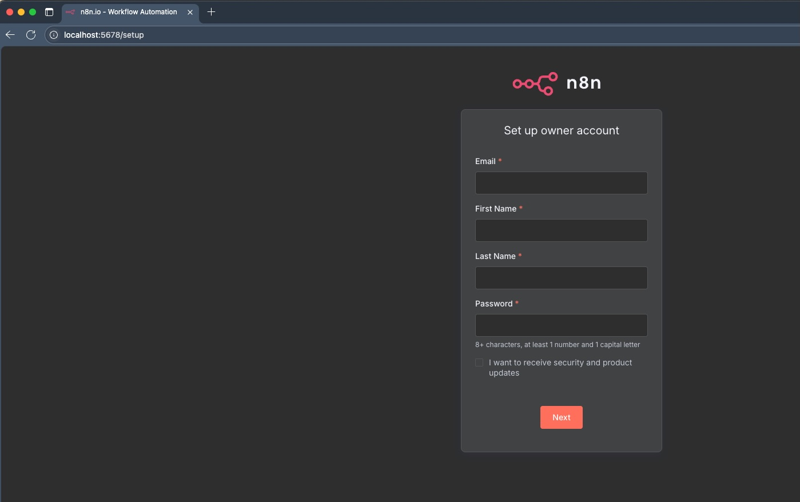
2.  **Access the Workflows:** Once logged in, click on the **Credentials** tab from the top menu or the sidebar navigation.
    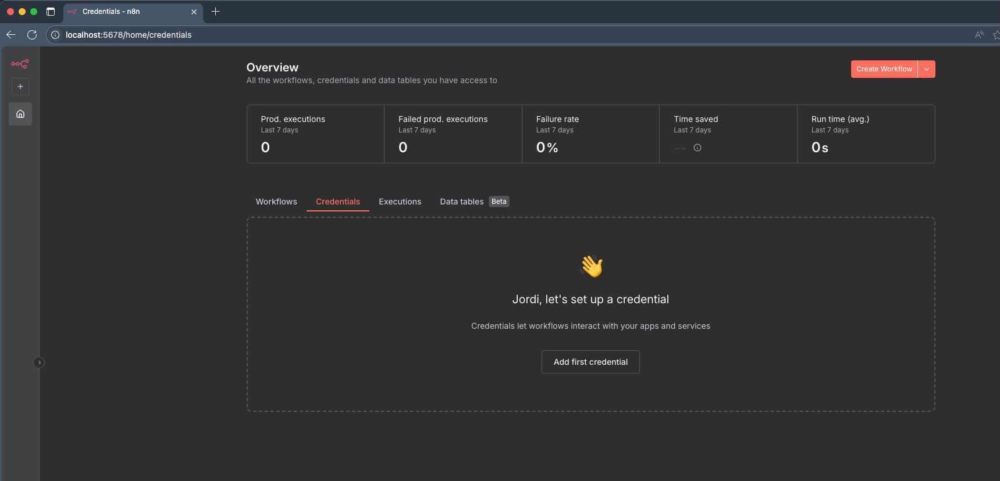
3.  **Add New Credential:** Click **Add first credential** or **Create Workflow** to start the process.

---

## 1. Telegram API (Input Trigger)

This credential allows the main workflow to listen for messages and send confirmation responses.

1.  **Select Service:** In the **Add new credential** dialog, search for and select **Telegram API**.
    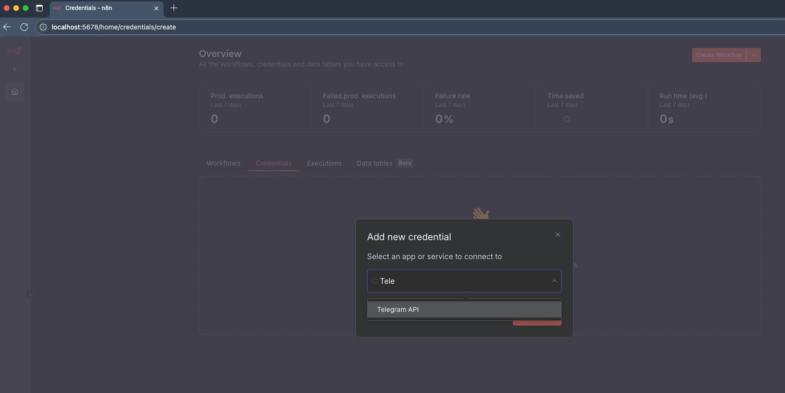
2.  **Fill Details:** You will need the **Access Token** obtained from BotFather in Telegram.
    * **Access Token:** Enter the token for your dedicated receipt bot.
    * **Base URL:** The default (`https://api.telegram.org`) is usually correct.
    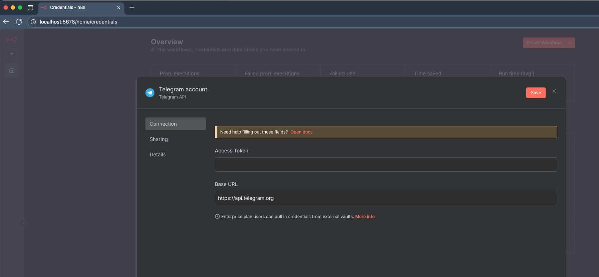
3.  **Save:** Click **Save**.

* **Telegram Documentation:** [https://docs.n8n.io/integrations/builtin/app-nodes/n8n-nodes-base.telegram/](https://docs.n8n.io/integrations/builtin/app-nodes/n8n-nodes-base.telegram/)

---

## 2. Google Drive OAuth2 API (File Archival)

This credential is used by **both workflows** to save the incoming file and download it for AI analysis.

1.  **Select Service:** Search for and select **Google Drive OAuth2 API**.
    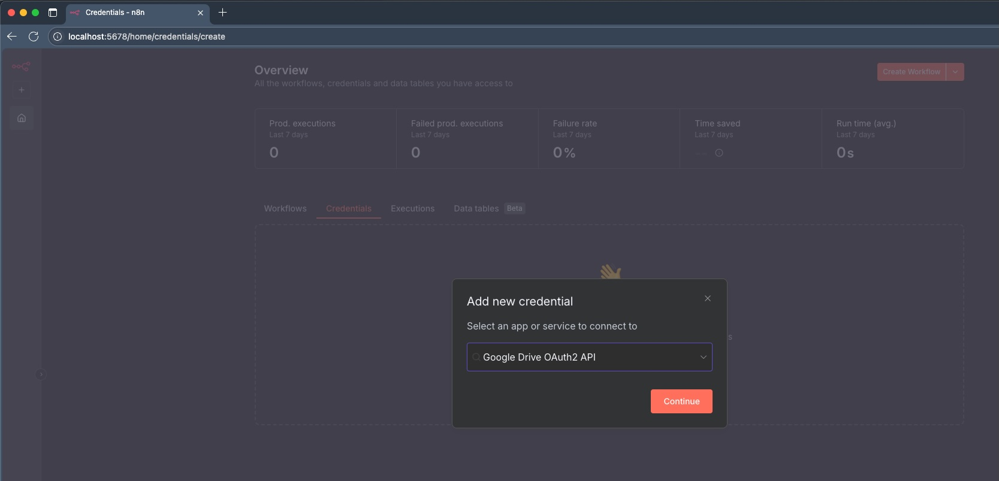
2.  **Configure OAuth:** This requires setting up an application in the Google Cloud Console to get the Client ID and Client Secret.
    * **OAuth Redirect URL:** Note the URL provided by n8n (e.g., `http://localhost:5678/rest/oauth2-credential/callback`). You must register this exact URL in the Google Console under your application's **Authorised redirect URIs**.
    * **Client ID & Client Secret:** Paste the credentials you obtained from Google Console.
    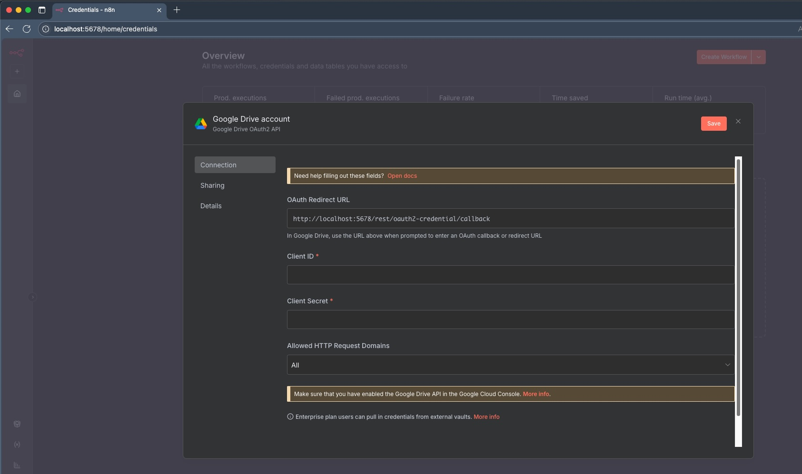
3.  **Connect Account:** After saving, click the **Connect** button to log into your Google Account and grant n8n access to Google Drive.

* **Google Drive Documentation:** [https://docs.n8n.io/integrations/builtin/app-nodes/n8n-nodes-base.google-drive/](https://docs.n8n.io/integrations/builtin/app-nodes/n8n-nodes-base.google-drive/)

---

## 3. Data Table (Ledger Database)

The structured output of the AI Vision Agent is now registered in a dedicated n8n Data Table (instead of a Google Sheet) [Conversation History]. You must configure this Data Table to contain the following exact column headers to ensure the workflows correctly map and write the data
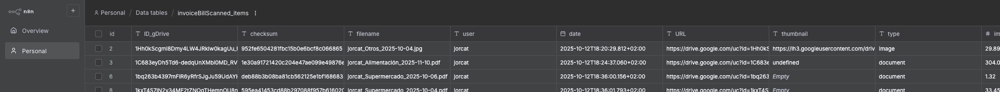

* **n8n Data Tables Documentation:** [https://docs.n8n.io/data/data-tables/](https://docs.n8n.io/data/data-tables/)

---

## 4. OpenAI (Image Analysis)

This is used by the **Sub-Workflow** (`retrieveImageFlow`) for image analysis via the GPT-4o-mini Vision model.

1.  **Select Service:** Search for and select **OpenAI**.
2.  **Fill Details:**
    * **API Key:** Paste your OpenAI API Key.
    * **Base URL:** The default (`https://api.openai.com/v1`) is usually correct.
    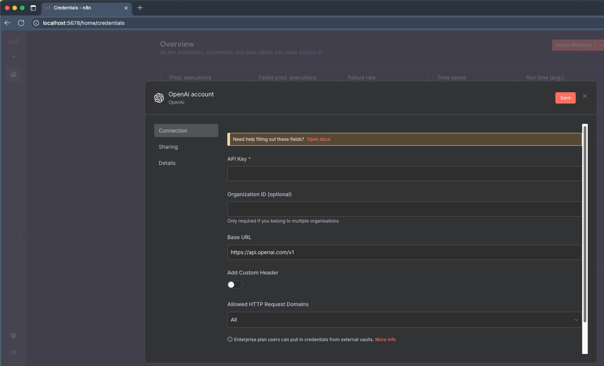
3.  **Save:** Click **Save**.

* **OpenAI Documentation:** [https://docs.n8n.io/integrations/builtin/app-nodes/n8n-nodes-base.open-ai/](https://docs.n8n.io/integrations/builtin/app-nodes/n8n-nodes-base.open-ai/)

---

## 5. Google Gemini (Document Analysis)

This is used by the **Sub-Workflow** (`retrieveImageFlow`) for PDF/document analysis.

1.  **Select Service:** Search for and select **Google Gemini (PaLM) API**.
2.  **Fill Details:**
    * **Host:** The default (`https://generativelanguage.googleapis.com`) is typically correct.
    * **API Key:** Paste your Google Gemini API Key.
    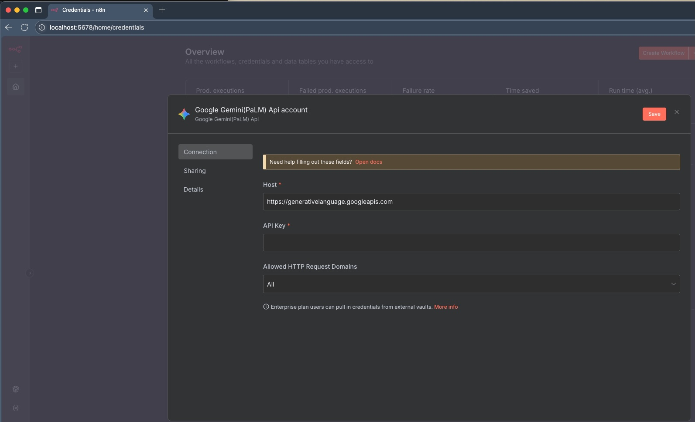
3.  **Save:** Click **Save**.

* **Google Gemini Documentation:** [https://docs.n8n.io/integrations/builtin/app-nodes/n8n-nodes-base.google-gemini/](https://docs.n8n.io/integrations/builtin/app-nodes/n8n-nodes-base.google-gemini/)

## 6. DeepSeek (Chat model)

This is used by the chatbot.

1.  **Select Service:** Search for and select **DeepSeek**.
2.  **Fill Details:**
    * **API Key:** Paste your DeepSeek API Key.
    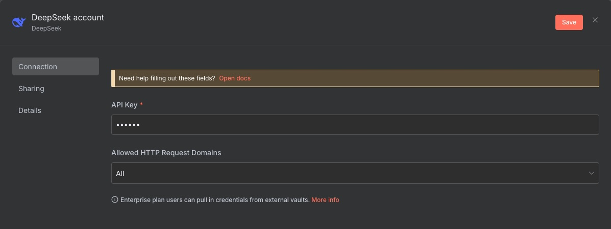
3.  **Save:** Click **Save**.

* **DeepSeek Documentation:** [https://docs.n8n.io/integrations/builtin/credentials/deepseek/](https://docs.n8n.io/integrations/builtin/credentials/deepseek/)

## 6. Redis (Cache)

This is used by the upload file.

1.  **Select Service:** Search for and select **Redis**.
    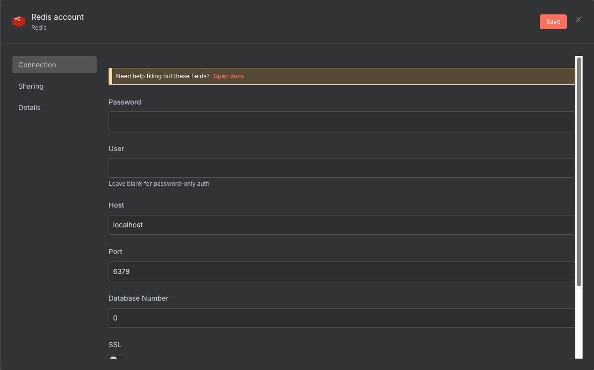

2.  **Fill Details:**
    * **Password:** Paste your password.
    * **User:** Redis user or Empty.
    * **Host:** Host.
    * **Port:** Port.
3.  **Save:** Click **Save**.

* **DeepSeek Documentation:** [https://docs.n8n.io/integrations/builtin/app-nodes/n8n-nodes-base.redis/](https://docs.n8n.io/integrations/builtin/app-nodes/n8n-nodes-base.redis/)

## 8. 🌐 Homelab Connectivity: Exposing n8n for Webhooks and OAuth

For the Telegram **Webhook** and the Google **OAuth2** credentials (Drive and Sheets) to function, your n8n instance must be accessible from the public internet. Since you are running in a homelab, using a simple port forward is often insecure.

Here are three secure, community-favourite alternatives for exposing internal services:

### 1. Cloudflare Tunnels (Recommended for Domain Users) ☁️

Cloudflare Tunnels (via the `cloudflared` daemon) establish a secure, outbound-only connection from your server to the Cloudflare network. This bypasses the need for opening firewall ports or port forwarding, requiring only a domain name managed by Cloudflare.

| Pros | Cons |
| :--- | :--- |
| **Security:** No open inbound ports on your router. | Requires a domain name (can be cheap). |
| **Reliability:** Leverages Cloudflare's global network and caching. | Requires the `cloudflared` binary or Docker container setup. |

**Setup Reference:**
* **Cloudflare Tunnels Documentation:** [https://developers.cloudflare.com/cloudflare-one/connections/connect-apps/install-and-setup/](https://developers.cloudflare.com/cloudflare-one/connections/connect-apps/install-and-setup/)

### 2. Pangolin or Self-Hosted Reverse Proxy (For Full Control) 🏠

For homelab users who prefer managing their public endpoint entirely within their network, a **Reverse Proxy** solution is ideal. While **Pangolin** is a viable, simple tunneling service often mentioned in the homelab community, solutions like **Traefik** or **Nginx Proxy Manager (NPM)** are the most common ways to manage external access when you own a domain and have ports open on your router.

| Pros | Cons |
| :--- | :--- |
| **Control:** Full management of SSL certificates and access rules. | Requires opening ports (443/80) on your router. |
| **Performance:** Excellent internal network performance. | More complex initial configuration (setting up certificates, internal networks). |

**Setup Reference (General Reverse Proxy):**
* **Nginx Proxy Manager:** [https://nginxproxymanager.com/](https://nginxproxymanager.com/)
* **Traefik Reverse Proxy:** [https://doc.traefik.io/traefik/](https://doc.traefik.io/traefik/)

### 3. ngrok or Tailscale Funnel (Quick and Temporary) 🧪

Services like **ngrok** and features like **Tailscale Funnel** create a temporary public URL that tunnels traffic directly to your local application. These are excellent for initial testing, debugging, or setups where a permanent domain is not desired.

**Setup Reference:**
* **Tailscale Funnel Documentation:** [https://tailscale.com/kb/1223/funnel/](https://tailscale.com/kb/1223/funnel/)
* **ngrok Documentation:** [https://ngrok.com/docs](https://ngrok.com/docs)

***

### Configuration Reminder

Regardless of the method chosen, you must correctly set the following environment variables in your n8n Docker setup and use the public URL in your Telegram and Google OAuth configurations:

```bash
# Example if using a domain with a Reverse Proxy
WEBHOOK_URL=[https://n8n.yourdomain.com](https://n8n.yourdomain.com) 
N8N_HOST=n8n.yourdomain.com